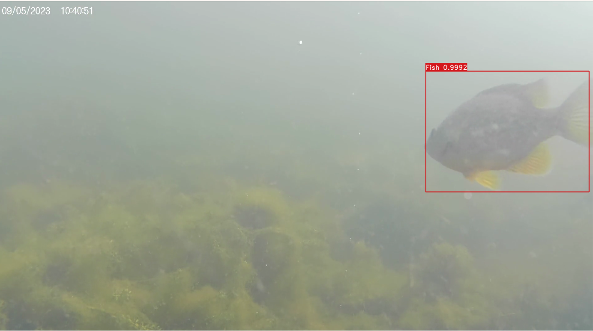
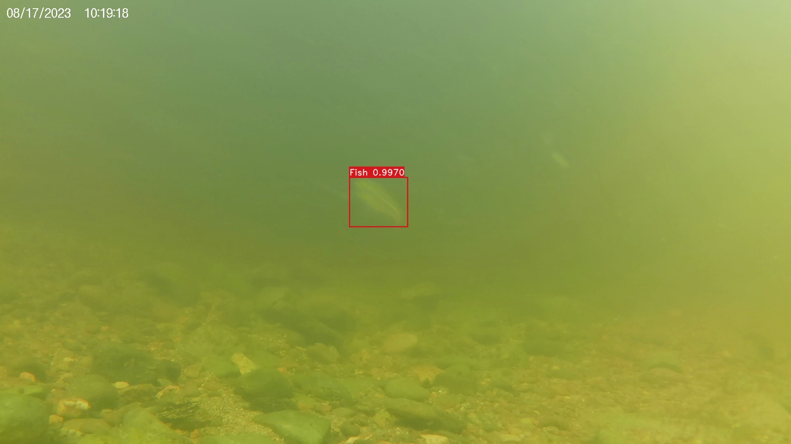
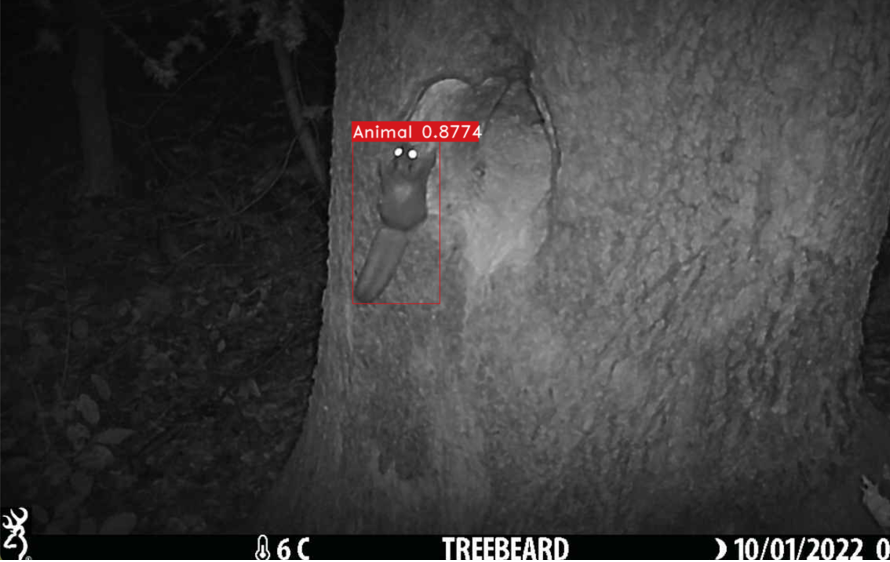
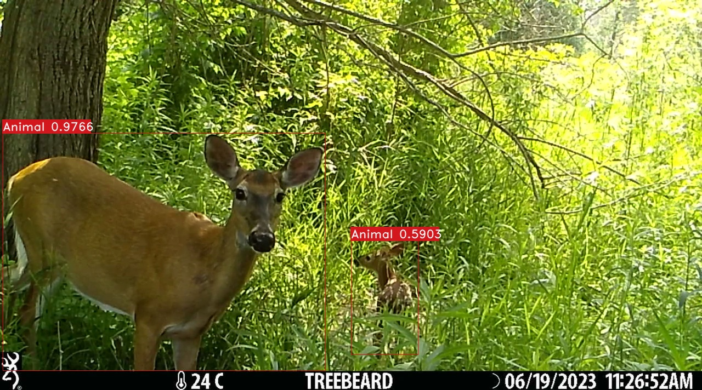

# Automated Camera Trapping Identification and Organization Network (ACTION)

## Overview

Action is a Python-based tool designed to bring the power of AI computer vision models to camera trap video analysis. Action lets you process hours of raw footage into positive detection clips where animals appear. Whether you're monitoring aquatic life with underwater cameras or tracking terrestrial wildlife, Action can save you from the time and tedious labour of reviewing footage manually.

## How it Works

Action takes one or more video files as input, along with several optional parameters to customize the process. Depending on the environment specified by the user, an appropriate object detection model is used: [YOLO-Fish v4](https://github.com/tamim662/YOLO-Fish) for aquatic videos, or [Megadetector v5](https://github.com/microsoft/CameraTraps/blob/main/megadetector.md) for terrestrial. Input videos are processed using the AI model, and a clip is created whenever terrestrial animals or fish are detected. At the end of the process, a filename_clips directory will include all the detections from the raw footage.

## Setup

Action is written in Python and requires a number of dependencies and large machine learning models (~778M) to be installed and downloaded.

The easiest way to use it is with the [pixi](https://prefix.dev/docs/pixi/overview) package manager. Pixi installs everything you need into a local `.pixi` folder (i.e., at the root of the project), without needing to modify your system.

### Installation Steps

1. Download the **Source code** (`zip` or `tar.gz`) from the [Releases](https://github.com/humphrem/action/releases) page, or use Git to clone this repo using `git clone https://github.com/humphrem/action.git`
2. [Install pixi](https://prefix.dev/docs/pixi/overview#installation) using the instructions for your operating system.  NOTE: on Windows, if using the [`iwr` command](https://learn.microsoft.com/en-us/powershell/module/microsoft.powershell.utility/invoke-webrequest?view=powershell-7.3), make sure you are using [PowerShell](https://learn.microsoft.com/en-us/powershell/scripting/overview?view=powershell-7.3) vs. [cmd.exe], or use the [MSI Windows Installer](https://prefix.dev/docs/pixi/overview#windows-installer).
3. Start a terminal and navigate to the root of the Action project folder you just downloaded or cloned, `cd action`
4. Enter the command `pixi run setup` to install dependencies and to download the AI models (NOTE: these are large, ~778M, and will take some time to download)

```sh
git clone https://github.com/humphrem/action.git
cd action
pixi run setup
```

### Using the Pixi Shell Environment

Each time you want to use Action, open a terminal, navigate to the Action folder, and start a shell with `pixi`:

```sh
pixi shell
```

This will make all of the dependencies installed with `pixi run setup` available.

When you are done, you can exit the pixi shell by using:

```sh
exit
```

## Running Action

With all dependencies installed and the models downloaded to the `models/` directory, you can now run action:

```sh
$ pixi shell
$ python3 action.py

usage: action.py [-h] [-e {terrestrial,aquatic}] [-b BUFFER] [-c CONFIDENCE]
                 [-m MIN_DURATION] [-f SKIP_FRAMES] [-d] [-o OUTPUT_DIR] [-s]
                 [-i] [--log-level {DEBUG,INFO,WARNING,ERROR}]
                 filename [filename ...]
action.py: error: the following arguments are required: filename
```

> [!NOTE]
> On Unix systems, you can also use `./action.py` without `python3`

### Options

Action can be configured to run in different ways using various arguments and flags.

| Option | Description | Example |
| --- | --- | --- |
| `filename` | Path to a video file, multiple video files, or a glob pattern. | `./video/*.mov` |
| `-e`, `--environment` | Type of camera environment, either aquatic or terrestrial. Defaults to `aquatic`. | `--environment terrestrial` |
| `-b`, `--buffer` | Number of seconds to add before and after detection. Cannot be negative. Defaults to 1.0 for aquatic and 5.0 for terrestrial. | `--buffer 1.0` |
| `-c`, `--confidence` | Confidence threshold for detection. Must be greater than 0.0 and less than 1.0. Defaults to 0.50. | `--confidence 0.45` |
| `-m`, `--minimum-duration` | Minimum duration for clips in seconds. Must be greater than 0.0. Defaults to 3.0 for aquatic and 10.0 for terrestrial. | `--minimum-duration 2.0` |
| `-f`, `--frames-to-skip` | Number of frames to skip when detecting. Cannot be negative. Defaults to half the frame rate. | `--frames-to-skip 15` |
| `-d`, `--delete-previous-clips` | Whether to delete clips from previous interrupted or old runs before processing a video again. | `--delete-previous-clips` |
| `-o`, `--output-dir` | Output directory to use for all clips. | `--output-dir ./output` |
| `-s`, `--show-detections` | Whether to visually show detection frames with bounding boxes. | `--show-detections` |
| `-i`, `--include-bbox-images` | Whether to include the bounding box images for the frames that trigger or extend each detection event, along with the videos in the clips directory. | `--include-bbox-images` |
| `--log-level` | Logging level. Can be `DEBUG`, `INFO`, `WARNING`, or `ERROR`. Defaults to `INFO`. | `--log-level DEBUG` |

> [!NOTE]
> The options with `-` or `--` are optional, while `filename` is a required argument

### Examples

To process a video named `recording.mov` using default settings, specify only the filename:

```sh
python3 action.py recording.mov
```

You can also include multiple filenames:

```sh
python3 action.py recording1.mov recording2.mov recording3.mov
```

Or use a file pattern:

```sh
python3 action.py ./videos/*.avi
```

Many other options can be altered (see above) to process videos in specific ways. For example:

```sh
python3 action.py ./video/aquatic.mov -c 0.60 -m 3.0 -s -b 1.0 -d -e aquatic
```

This would process the file `./video/aquatic.mov`, deleting clips from a previous run (e.g. to re-analyze the same video with new settings), use the YOLO-Fish model, set a confidence threshold of `0.60` (i.e. include fish detections with confidence `0.60` and higher), make all clips `3.0` seconds minimum with a `1.0` second buffer added to the start and end of the clip (i.e. `1.0` + `3.0` + `1.0` = `5.0` seconds), and visually show each initial detection using bounding boxes on the video frame.

```sh
python3 action.py ./video/terrestrial.mov -c 0.45 -m 8.0 -b 2.0 -e terrestrial -f 25
```

This would process the file `./video/terrestrial.mov`, use the Megadetector model, set a confidence threshold of `0.45` (i.e. include animal detections with confidence `0.45` and higher), make all clips `8.0` seconds minimum with a `2.0` second buffer added to the start and end of the clip (i.e. `2.0` + `8.0` + `2.0` = `12.0` seconds), and run detections on every 25th frame in the video.

### Example Bounding Box Images

If either of the `-s`/`--show-detections` or `-i`/`--include-bbox-images` flags are included, bounding boxes and confidence scores are also displayed (with `-s`) or written to the clips directory (with `-i`).  These can be helpful when trying to understand what triggered a detection event, or caused it to be extended.

Here are some examples of aquatic and terrestrial bounding box images.

#### Aquatic Examples




#### Terrestrial Examples



